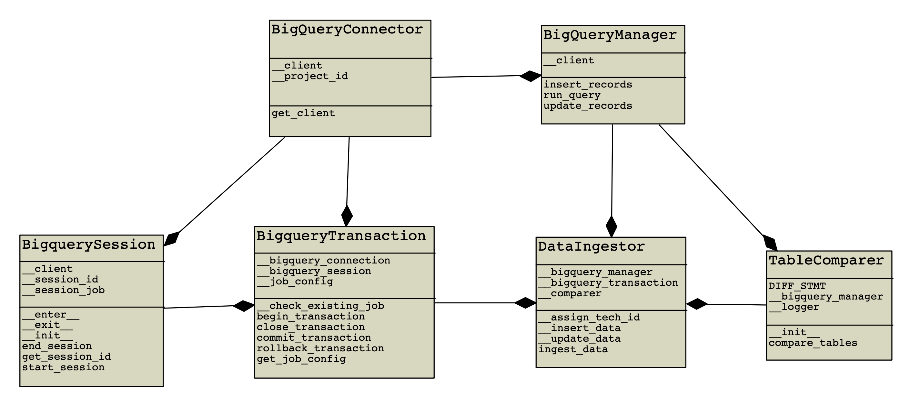
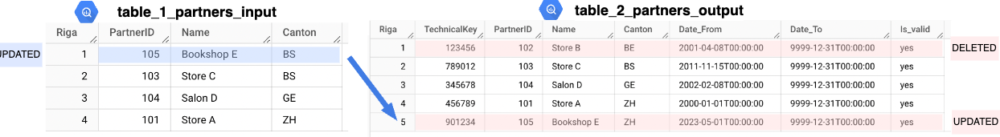
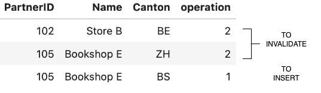

<p align="center">

</p>

# Worldline - Data Engineer Transformation SCD2 use case

**Maurizio Idini**
16/01/2024

## Index
 - [Introduction](#introduction)
 - [Project Description](#project-description)
    - [Folder structure](#folder-structure)
    - [Content](#content)
 - [Business Logic](#business-logic)
    - [UML diagram](#uml-diagram)
    - [Code documentation](#code-documentation)
 - [Flow](#flow)
 - [Run the code](#run-the-code)
 - [Future improvements](#future-improvements)


## Introduction

This is a simple document that briefly describes the repository.
The aim of the use case implemented in this repository is to perform table transformations based on *Slowly Changing Dimension type2*

The module is written in **Python 3.8**, using **Docker** container.
The lib is written using **google-cloud** library, documented using **Docstring** and tested using **pytest**.

#### Disclaimer

The code is written for the transformation module. It is assumed that the bigquery tables already exists.

Before running the code, please check if the `application_default_credential.json` credential file is already on your machine, in the path `~/.config/gloud/`.
If not, please run the following command in the terminal `gcloud auth application-default login` and follow the steps.

## Project Description

### Folder structure

```markdown
worldline_bq_usecase
┣ bin
┃ ┣ down.sh
┃ ┣ test.sh
┃ ┣ test.up.sh
┃ ┗ up.sh
┣ lib
┃ ┣ data
┃ ┃ ┣ comparer
┃ ┃ ┃ ┣ TableComparer.py
┃ ┃ ┃ ┗ __init__.py
┃ ┃ ┣ ingestor
┃ ┃ ┃ ┣ DataIngestor.py
┃ ┃ ┃ ┗ __init__.py
┃ ┃ ┗ __init__.py
┃ ┗ dbmanagement
┃ ┃ ┣ connector
┃ ┃ ┃ ┣ BigQueryConnector.py
┃ ┃ ┃ ┗ __init__.py
┃ ┃ ┣ tablemanagement
┃ ┃ ┃ ┣ BigQueryManager.py
┃ ┃ ┃ ┗ __init__.py
┃ ┃ ┣ transaction
┃ ┃ ┃ ┣ BigquerySession.py
┃ ┃ ┃ ┣ BigqueryTransaction.py
┃ ┃ ┃ ┗ __init__.py
┃ ┃ ┗ __init__.py
┣ sql_example
┃ ┣ setup_tables
┃ ┃ ┣ create_populate_Table2_Partners_Output.sql
┃ ┃ ┗ create_populate_Table_1_Partners_Input.sql
┃ ┣ simulate_update_source.sql
┃ ┗ update_table_2_partners_output.sql
┣ tests
┃ ┣ integration
┃ ┃ ┣ data
┃ ┃ ┃ ┣ comparer
┃ ┃ ┃ ┃ ┗ TableComparer_test.py
┃ ┃ ┃ ┗ ingestor
┃ ┃ ┃ ┃ ┗ DataIngestor_test.py
┃ ┃ ┗ dbmanagement
┃ ┃ ┃ ┣ connector
┃ ┃ ┃ ┃ ┗ BigQueryConnector_test.py
┃ ┃ ┃ ┗ tablemanagement
┃ ┃ ┃ ┃ ┗ BigQueryManager_test.py
┃ ┗ unit
┃ ┃ ┗ data
┃ ┃ ┃ ┣ comparer
┃ ┃ ┃ ┃ ┗ TableComparer_test.py
┃ ┃ ┃ ┗ ingestor
┃ ┃ ┃ ┃ ┗ DataIngestor_test.py
┣ .gitignore
┣ Dockerfile
┣ README.md
┣ app.py
┣ docker-compose.yml
┗ requirements.txt
```

### Content

The main folder contains

 - `requirements.txt` with the libraries used in the project
 - `Dockerfile` and `docker-compose.yml` for the Docker container
 - `lib` that contains the code
 - `bin` folder with bash script useful to run docker environments
 - `app.py` that contains code FlaskAPI code to trigger the process
 - `README.md` that contains this description

The `lib` code is composed by

 - `data` folder that contains code for *comparer* and *ingestor*
 - `dbmanagement` folder that contains code for *connector*, **tablemanagement* and *transaction*

Furthermore, the repository contains a `sql_example` folder with sql files to
 - [generate table Table1_Partners_Input.sql](./sql_example/setup_tables/create_populate_Table_1_Partners_Input.sql)
 - [generate table Table2_Partners_Output.sql](./sql_example/setup_tables/create_populate_Table2_Partners_Output.sql)
 - [simulate transformation tables](./sql_example/update_table_2_partners_output.sql2)

## Business Logic

### UML diagram

<p align="center">

</p>


### Code documentation

The `docs` folder contains class documentation generated using [pdoc](https://pdoc.dev/) library.
The documentation is accessible through [Documentation Main Page](https://idini.github.io/worldline_bq_usecase/lib.html)

### Flow

The *Transformation_SCD2* process is described as follows:

<p align="center">

</p>

A process (in the use_case the */trigger/* POST call) calls `DataIngestor.ingest_data` on the source and destination tables with a specific Primary Key. This Primary Key is also the Surrogate Key on the destination table.

The `DataIngestor` object is initialized using an instance of `BigQueryConnector` to connect to BigQuery, and the connection is already instantiated on a specific `project_id`.

 ```
project_id = 'worldline-prj'

bq_client = BigQueryConnector(project_id).get_client()
ingestor = DataIngestor(bq_client)
ingestor.ingest_data(src_table, dest_table, pkey)

 ```

The `ingest_data` method calls `TableComparer.compare_tables` on the already mentioned tables and checks for new/updated/deleted records on the source table based on the destination table.

Since the destination table is a DWH table, it should contain technical parameters such as  `TechnicalKEY`, `Date_from`, `Date_to` and `Is_valid`. Furthermore, the schema for the source table and destination table should be the same, except for technical fields in the destination table.

<p align="center">

</p>

The check is performed using a SQL query to delegate computation to the BigQuery engine, excluding non-valid records (`Is_valid = 'no'`) and technical fields.

 ```
with src_table as (
    select *
    from `src_table`
),
dest_table as (
    select * except(TechnicalKey, Date_From, Date_To, Is_valid)
    from `dest_table`
    where Is_valid = 'yes'
),
rows_to_update as (
    select *
    from src_table
    except distinct
    select *
    from dest_table
),
rows_to_delete as (
    select *
    from dest_table
    except distinct
    select *
    from src_table
)
select *, 1 as operation # new/updated
from rows_to_update
union all
select *, 2 as operation # deleted
from rows_to_delete;
 ```

The result of `TableComparer.compare_tables` is a `pandas.DataFrame` containing all fields from the source/destination table and a column`operation` where

 - value `1` means new or updated rows (to insert in the destination table)
 - value `2` means deleted rows (to invalidate in the destination table)

<p align="center">

</p>

Using that DataFrame, the `ingest_data` method updates the destination table by invalidating existing records (setting `Is_valid = 'no'`) for every primary key stored in the DataFrame. This ensures that every record to be updated and deleted is invalidated. Then, the method inserts the records contained in the DataFrame where the `operation` value is equal to 1, in order to insert new and updated records.

<p align="center">

</p>

## Run the code

You can run the code in two ways:
 -  using `python app.py` in your local machine
 -  using Docker, running `./bin/up.sh`

 You can run the tests accessing to `test_transformation_scd2` Docker container running
 - `./bin/test.up.sh` and `./bin/test.sh`
 - `./bin/test.sh` in your local machine

Verify the deployment by navigating to [127.0.0.1:5001](http://127.0.0.1:5001) in your preferred browser.


## Future improvements
 -  Check schema between source and destination table
 -  Implement *Factory pattern* in `Connector`, `TableManagement` and `Transaction` in order to extend DataIngestor with the use of others DB
